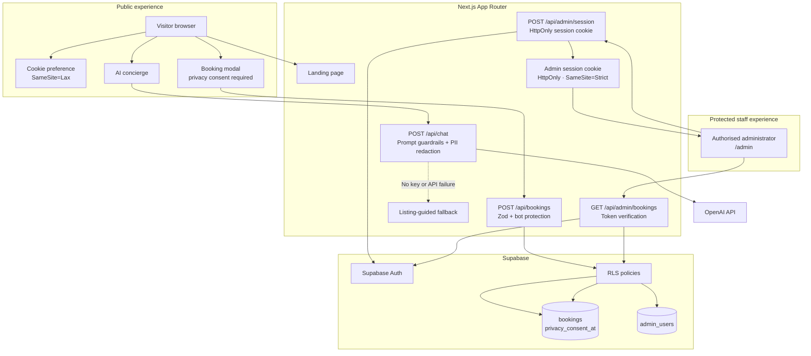

# Apex Living — The Aster House

> English reference README｜[中文主文档](README.md)

A premium, responsive real-estate lead-generation MVP for the fictional demonstration project The Aster House in Potts Point, Sydney.

## Features

- Editorial, mobile-first landing page with project facts, amenities, lifestyle imagery and booking CTAs.
- AI property concierge using OpenAI when configured, with a listing-grounded local fallback when the key is missing or the upstream service fails.
- Viewing request form with client feedback, server-side Zod validation, recorded privacy consent and Supabase persistence.
- Supabase Auth-protected administrator portal at `/admin` for approved booking leads.
- Privacy and security controls: preference cookie, chat PII redaction, honeypot, optional Cloudflare Turnstile, API rate limiting, RLS and production security headers.

## Architecture



For the expanded diagram and access rules, see [`docs/architecture.md`](docs/architecture.md). The editable Mermaid source is [`docs/system-architecture.mmd`](docs/system-architecture.mmd).

## Local setup

```bash
npm install
cp .env.example .env.local
# Add the required values to .env.local
npm run dev
```

The development server uses **port 3002** and does not use ports 3000 or 3001: <http://localhost:3002>

The visual site and AI fallback work without environment variables. Booking persistence requires Supabase configuration.

## Environment variables

| Variable | Required | Purpose |
| --- | --- | --- |
| `OPENAI_API_KEY` | No | Enables the live OpenAI concierge. |
| `OPENAI_MODEL` | No | Defaults to `gpt-4.1-mini`. |
| `NEXT_PUBLIC_SUPABASE_URL` | For bookings | Supabase project URL. |
| `NEXT_PUBLIC_SUPABASE_PUBLISHABLE_KEY` | For bookings | Publishable key used under RLS. |
| `NEXT_PUBLIC_TURNSTILE_SITE_KEY` | Recommended | Cloudflare Turnstile site key. |
| `TURNSTILE_SECRET_KEY` | Recommended | Server-only Turnstile secret. |
| `UPSTASH_REDIS_REST_URL` | Recommended in production | Shared rate-limiting backend. |
| `UPSTASH_REDIS_REST_TOKEN` | Recommended in production | Server-only Upstash Redis token. |

Configure both Turnstile values together. Without Upstash, the app uses an in-memory limiter suitable for local and demo deployments.

## Supabase setup

Run every migration in [`supabase/migrations/`](supabase/migrations/) in numeric order, including `004_harden_public_booking_insert.sql`.

To create an administrator:

1. Create an email/password user in **Authentication → Users**.
2. Grant that user access in the SQL Editor:

   ```sql
   insert into public.admin_users (user_id) values ('AUTH_USER_UUID');
   ```

3. Visit `/admin` and sign in.

The portal uses a one-hour `HttpOnly`, `SameSite=Strict` session cookie. The browser never receives a Service Role Key.

## Privacy and security

- Booking forms require consent and record the consent timestamp separately.
- Booking details are not sent to the AI concierge. Obvious emails and phone numbers typed into chat are redacted before the OpenAI request.
- The site sets only a one-year preference cookie and has no advertising or analytics cookies.
- Chat, booking and admin-login endpoints are rate-limited.
- A honeypot is always enabled; Turnstile is server-verified when configured.
- Production responses include HSTS, CSP, frame protection, Referrer Policy and Permissions Policy.

See the in-product [`/privacy`](app/privacy/page.tsx) notice. Replace its demonstration contact and legal copy before collecting real customer information.

### Publishable-key limitation

Because this MVP intentionally uses only a Supabase publishable key, an anonymous caller can still bypass the Next.js booking route and call the Supabase insert endpoint directly. Migration `004` enforces consent, field length and viewing-slot integrity at the database layer, but cannot prove request origin. For high-volume production, move insertion behind a Supabase Edge Function or another server-side privileged boundary.

## Verification

```bash
npm run lint
npm run typecheck
npm test
npm run build
npm audit
```

## Deploy to Vercel

Import the repository into Vercel, configure the required variables from `.env.example`, run all Supabase migrations and create at least one `admin_users` administrator before launch.
