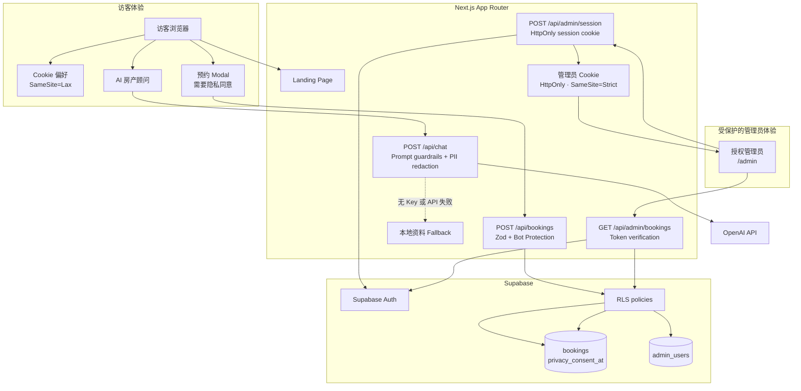

# Apex Living — The Aster House

> 中文主文档｜[English README](README.en.md)

这是一个面向悉尼高端地产展示的 Next.js MVP。项目资料与房源均为演示数据，页面包含 AI 房产顾问、看房预约、Supabase 持久化、管理员 Lead Portal，以及隐私与安全防护。

## 功能概览

- 响应式高端地产 Landing Page，包含项目 Banner、关键数据、Amenities、生活方式图片和预约入口。
- AI 房产顾问：配置 OpenAI 后使用 listing-grounded 回答；没有 API Key 或上游失败时使用本地资料 fallback。
- 看房预约：客户端即时校验，服务端 Zod 校验，记录隐私同意时间并写入 Supabase。
- 管理员门户：Supabase Auth 登录，只有 `admin_users` allowlist 用户能查看预约资料。
- 隐私与安全：Cookie 偏好、聊天邮箱/电话脱敏、honeypot、可选 Cloudflare Turnstile、API 限流、RLS 和生产安全响应头。

## 架构图



完整架构说明见 [`docs/architecture.md`](docs/architecture.md)，Mermaid 源文件见 [`docs/system-architecture.mmd`](docs/system-architecture.mmd)。

## 本地启动

```bash
npm install
cp .env.example .env.local
# 编辑 .env.local，填入需要的服务配置
npm run dev
```

开发服务器固定使用 **3002**，不会占用 3000 或 3001：<http://localhost:3002>

视觉页面和 AI fallback 不需要环境变量。预约持久化需要 Supabase 配置。

## 环境变量

| 变量 | 必需 | 用途 |
| --- | --- | --- |
| `OPENAI_API_KEY` | 否 | 启用真实 OpenAI 顾问。 |
| `OPENAI_MODEL` | 否 | 默认 `gpt-4.1-mini`。 |
| `NEXT_PUBLIC_SUPABASE_URL` | 预约必需 | Supabase 项目 URL。 |
| `NEXT_PUBLIC_SUPABASE_PUBLISHABLE_KEY` | 预约必需 | 仅配合 RLS 使用的 publishable key。 |
| `NEXT_PUBLIC_TURNSTILE_SITE_KEY` | 推荐 | Cloudflare Turnstile 公钥。 |
| `TURNSTILE_SECRET_KEY` | 推荐 | 仅服务端使用的 Turnstile 密钥。 |
| `UPSTASH_REDIS_REST_URL` | 生产推荐 | 启用跨 Serverless 实例共享限流。 |
| `UPSTASH_REDIS_REST_TOKEN` | 生产推荐 | Upstash Redis 服务端 Token。 |

Turnstile 两个变量需要同时配置；Upstash 未配置时会使用本地内存限流，适合本地和 Demo。

## Supabase 配置

按顺序在 Supabase SQL Editor 执行 [`supabase/migrations/`](supabase/migrations/) 下的所有 migration，至少包括：

1. `001_create_bookings.sql`
2. `002_allow_public_booking_insert.sql`
3. `003_admin_access_and_privacy_consent.sql`
4. `004_harden_public_booking_insert.sql`

创建管理员：

1. 在 Supabase Dashboard 的 **Authentication → Users** 创建 email/password 用户。
2. 在 SQL Editor 中授权该用户：

   ```sql
   insert into public.admin_users (user_id) values ('AUTH_USER_UUID');
   ```

3. 打开 `/admin` 登录查看预约线索。

管理员 session 使用一小时 `HttpOnly`、`SameSite=Strict` Cookie。浏览器不会获得 Service Role Key。

## 隐私与安全说明

- 预约表单必须勾选隐私同意，并单独记录同意时间。
- 预约资料不会发送到 AI；聊天中输入的明显邮箱和电话号码会在发送给 OpenAI 前脱敏。
- 网站只使用一个 Cookie 偏好 Cookie，不使用广告或分析 Cookie。
- `/api/chat`、`/api/bookings` 和管理员登录接口均有限流。
- 预约接口始终启用 honeypot；配置 Turnstile 后会进行服务端验证。
- 生产环境启用 HSTS、CSP、禁止 iframe、Referrer Policy 和 Permissions Policy。

完整隐私说明见 [`/privacy`](app/privacy/page.tsx)。正式上线前请替换其中的演示联系邮箱和法律文本。

### Publishable key 的架构限制

本 MVP 按要求只使用 Supabase publishable key，因此匿名用户仍可能绕过 Next.js 预约接口，直接调用 Supabase 插入接口。`004` migration 会在数据库层校验隐私同意、字段长度和可用看房时段，但无法证明请求来自 Next.js。高流量生产环境应将写入迁移到 Supabase Edge Function 或其他服务端特权边界。

## 验证命令

```bash
npm run lint
npm run typecheck
npm test
npm run build
npm audit
```

## Vercel 部署

将仓库导入 Vercel，在 Project Settings 配置 `.env.example` 中需要的变量，然后部署。部署前请在 Supabase 执行全部 migration，并创建至少一个 `admin_users` 管理员。
