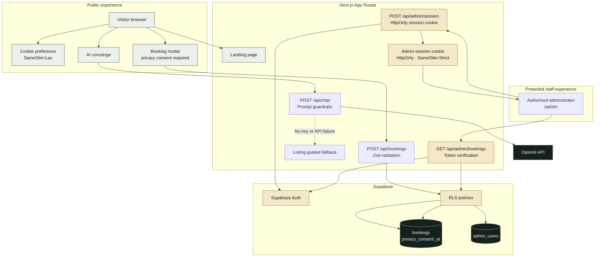

# Apex Living Architecture

## Access rules

- The public publishable key can create a booking only when its RLS integrity checks pass; the Next.js route adds validation and bot protection.
- Booking information has no public read, update or delete policy.
- The admin portal must authenticate with Supabase Auth and match an `admin_users` allowlist entry before it can query bookings.
- The browser never receives a Service Role Key, customer booking data in cookies, or AI conversation history as persistent storage.
